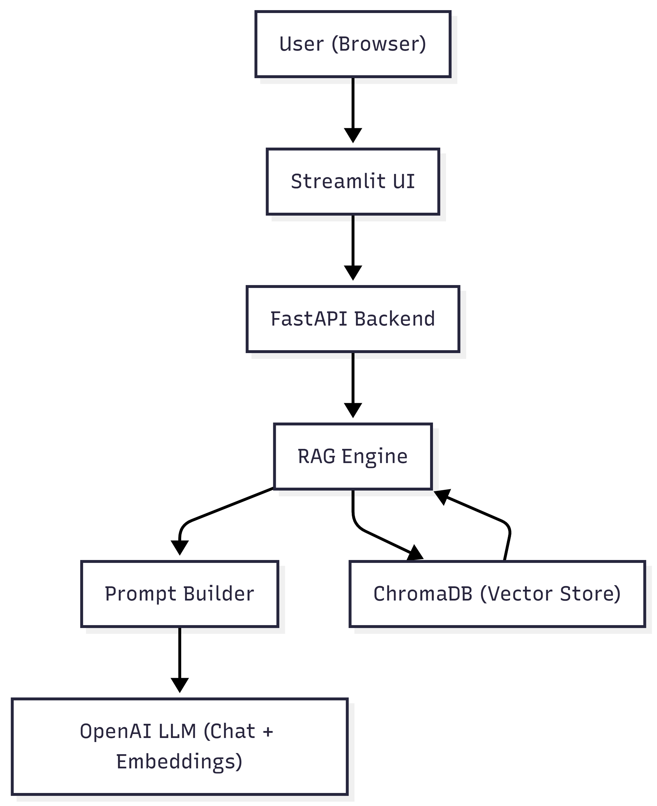

# AI Study Coach: A Retrieval-Augmented Generative AI Tutor for Data Structures

**Student Name:** Sanath
**Course:** Prompt Engineering & AI
**Date:** Dec 13, 2025
**Project Type:** Generative AI Application – Educational Content Generator / Personalized Learning Content Creator

---

## 1. Abstract

This project presents **AI Study Coach**, a generative AI system designed to help students study *Introduction to Data Structures* by transforming raw course materials into an interactive tutoring experience. The system combines **Retrieval-Augmented Generation (RAG)**, **prompt engineering**, and **synthetic data generation** to support:

* Question answering over lecture notes and slides
* Simple, beginner-friendly explanations and analogies
* Automatic generation of practice quizzes and exam-style questions

The backend is implemented using **FastAPI**, OpenAI’s API, and **ChromaDB** as a vector database, while a **Streamlit** frontend provides a simple web interface. The project includes a documented architecture, evaluation on answer quality and latency, discussion of challenges, future improvements, and ethical considerations around bias, hallucinations, and student over-reliance on AI.

---

## 2. Objectives

The primary objectives of this project were:

1. **Develop a practical generative AI application** that addresses a real educational need: helping students understand and practice data structures.
2. **Implement at least two advanced generative AI components** from the project requirements:

   * Retrieval-Augmented Generation (RAG)
   * Prompt Engineering
   * Synthetic Data Generation
3. **Deliver a complete end-to-end system** with:

   * Working backend and frontend
   * Knowledge base construction and retrieval
   * Evaluation metrics and analysis
   * Documentation, demo video, and project web page

---

## 3. System Overview

### 3.1 High-Level Functionality

AI Study Coach supports three core user workflows:

1. **Ask Questions (Q&A mode)**

   * Students ask natural language questions about data structures (e.g., “How does a binary search tree differ from an array?”).
   * The system retrieves relevant chunks from course PDFs using a vector database and generates a focused answer citing sources.

2. **Explain Concepts (Explanation modes)**

   * **Explain Simply:** Provides beginner-friendly, simplified explanations.
   * **Explain with Analogy:** Adds real-world analogies to help intuition.

3. **Generate Practice Quizzes (Quiz mode + synthetic data)**

   * Generates multiple-choice questions (MCQs) with correct answers and explanations, based strictly on the uploaded materials.
   * Can also generate a synthetic Q&A dataset for later evaluation or reuse.

### 3.2 Main Components

* **Document Ingestion & Chunking**

  * PDF parsing, text cleaning, chunking with overlap
* **Embedding & Vector Store**

  * OpenAI embeddings + ChromaDB
* **RAG Engine**

  * Retrieval of top-K relevant chunks per query
* **Prompt Orchestrator**

  * Mode-specific prompts for Q&A, quiz generation, explanations
* **LLM Client**

  * OpenAI chat completions with error handling
* **Synthetic Data Generator**

  * Production of exam-style Q&A pairs from chunks
* **Web Frontend (Streamlit)**

  * Simple UI for interacting with the system

---

## 4. System Architecture




### 4.1 Architecture Diagram

1. **User (Browser)**
   Interacts via a Streamlit web app.

2. **Frontend (Streamlit App)**

   * Sends requests to backend `/ask` and `/generate_synthetic` endpoints.
   * Renders model responses and displays which sources were used.

3. **Backend (FastAPI)**

   * Exposes HTTP endpoints:

     * `GET /health` – health check
     * `POST /ask` – main RAG-based tutor interface
     * `POST /generate_synthetic` – synthetic Q&A generation
   * Orchestrates RAG pipeline and LLM calls.

4. **RAG Pipeline**

   * **Document Ingestion (offline script)**

     * Reads PDFs from `data/raw/`
     * Extracts and cleans text
     * Splits into overlapping chunks
     * Embeds and stores in ChromaDB with metadata
   * **Query-time Retrieval**

     * Embeds user question
     * Retrieves top-K similar chunks
     * Filters by similarity threshold
     * Wraps chunks into a structured context with source IDs.

5. **Prompt Engineering Layer**

   * Builds different prompts depending on mode:

     * `qa` – factual Q&A from context
     * `quiz` – MCQ generation in JSON format
     * `explain_simple` – beginner explanation
     * `explain_analogy` – answer + analogy
   * Includes system-level constraints to restrict answers to context and encourage “I don’t know” when appropriate.

6. **Vector Database (ChromaDB)**

   * Stores embeddings and metadata:

     * `course`, `source_file`, `chunk_index`
   * Persistent on disk under `vector_store/chroma/`.

7. **LLM Client (OpenAI)**

   * Uses:

     * `text-embedding-3-small` for embeddings
     * `gpt-4.1-mini` (configurable) for chat completions
   * Wraps calls and returns answer strings to the backend.

---

## 5. Implementation Details

### 5.1 Technology Stack

* **Programming Language:** Python
* **Backend Framework:** FastAPI (`backend/main.py`)
* **Frontend:** Streamlit (`frontend/app.py`)
* **Vector Store:** ChromaDB (persistent local directory)
* **Models (via OpenAI API):**

  * Embeddings: `text-embedding-3-small`
  * Chat: `gpt-4.1-mini` (or equivalent)
* **PDF Processing:** `pypdf`
* **Testing:** `pytest`

### 5.2 Directory Structure

```text
ai-study-coach/
├─ backend/          # Core application logic (API, RAG, prompts, embeddings)
├─ frontend/         # Streamlit app
├─ data/             # Raw PDFs, processed text, synthetic data
├─ vector_store/     # ChromaDB persistent index
├─ tests/            # Automated tests
├─ web/              # Public project page (GitHub Pages)
├─ docs/             # Report PDF, diagram, etc.
```

---

### 5.3 Document Ingestion & Chunking

**Files:** `backend/chunking.py`, `backend/ingest_docs.py`

Workflow:

1. **PDF Extraction**

   * Uses `PdfReader` to extract text from each page and concatenate.

2. **Cleaning**

   * Normalizes whitespace and removes extraneous line breaks and tabs.

3. **Chunking Strategy**

   * Creates overlapping chunks using a sliding window:

     * Default chunk size ≈ 1000 tokens (approx. 1000 words in this simplified version)
     * Overlap ≈ 200 tokens
   * Rationale:

     * Large enough to preserve context (e.g., full explanations, definitions)
     * Overlap reduces boundary issues where important information lies at chunk edges.

4. **Processed Output**

   * Each processed file saved as `courseName_filename_chunks.txt` in `data/processed/` with chunk markers (`---chunk-n---`).

5. **Vector Store Ingestion**

   * `backend/ingest_docs.py`:

     * Reads processed chunk file
     * Creates embeddings using OpenAI
     * Stores `documents`, `ids`, and `metadatas` in ChromaDB:

       * `course`, `source_file`, `chunk_index`

This ingestion is run as an **offline preprocessing step**:

```bash
python -m backend.ingest_docs --course "intro_data_structures"
```

---

### 5.4 RAG Pipeline

**File:** `backend/rag_pipeline.py`

Key components:

1. **Retrieval**

   * Embeds the user query using `embed_text`.
   * Runs `collection.query` in ChromaDB with:

     * `n_results = TOP_K` (e.g., 5)
   * Transforms distances into a crude similarity score:
     [
     \text{similarity} = \frac{1}{1 + \text{distance}}
     ]
   * Filters out low-similarity chunks below `MIN_SIMILARITY_SCORE` (e.g., 0.3).

2. **Chunk Representation**

   * Each retrieved chunk is wrapped in a `RetrievedChunk` dataclass:

     * `content`
     * `source_id = source_file#chunk_index`
     * `score` (the similarity)

3. **Prompt Assembly & LLM Call**

   * Uses `build_tutor_prompt(mode, question, chunks)` from `prompts.py`.
   * Calls OpenAI chat model with:

     * System message: strict instructions to rely only on provided context
     * User message: detailed task instructions
   * Returns:

     * `answer: str`
     * `chunks: List[RetrievedChunk]` (for UI display).

---

### 5.5 Prompt Engineering

**File:** `backend/prompts.py`

The system is centrally controlled by a **system prompt**:

> “You are an AI study coach for the course 'Introduction to Data Structures'. You answer questions STRICTLY based on the provided context. If the answer is not in the context, say 'I don't know from the provided materials.' Be concise but clear, and show which sources you used.”

Different modes:

1. **Q&A Mode (`qa`)**

   * Instructions:

     * Only use provided context
     * Explicitly cite sources as `[Source 1]`, `[Source 2]`
     * Admit ignorance when context is insufficient.

2. **Quiz Mode (`quiz`)**

   * Task:

     * Generate 5 MCQs
     * Return **JSON array only** where each element has:

       * `question`, `options`, `correct_index`, `explanation`, `source`
   * This structured format simplifies parsing and (if desired) further automated evaluation.

3. **Explain Simply (`explain_simple`)**

   * Style:

     * Talk as if to a motivated 12-year-old.
     * Avoid jargon or explain it if used.

4. **Explain with Analogy (`explain_analogy`)**

   * Style:

     * Answer the question
     * Provide at least one concrete real-world analogy.

These prompt styles implement **systematic prompting strategies**, **context management**, and **specialized interactions** for different learning needs.

---

### 5.6 Synthetic Data Generation

**File:** `backend/synthetic_data.py`

To support evaluation and extended practice:

1. **Sampling Chunks**

   * Selects up to `max_chunks` documents from the Chroma collection.

2. **Prompt to LLM**

   * For each selected chunk, the LLM is asked to generate 3 exam-style Q&A pairs:

     * Each entry includes `question`, `answer`, `difficulty` (easy/medium/hard).

3. **JSON Output**

   * All generated items are aggregated and stored in:

     * `data/synthetic/<course_name>_synthetic_qa.json`

4. **Usage**

   * This data can be:

     * Used as additional practice content in future work
     * Manually evaluated to measure quality and coverage
     * (Potentially) used to augment the knowledge base (with caution, due to risk of hallucinations).

---

### 5.7 Frontend UI

**File:** `frontend/app.py`

* Built using **Streamlit**, allowing quick development of an interactive web UI.
* Key elements:

  * Sidebar:

    * Mode selection: Q&A, Explain Simply, Explain with Analogy, Generate Quiz Questions
    * “Check API health” button to call `/health`.
  * Main panel:

    * Text area for question input
    * “Ask” button triggers POST `/ask`
    * Displays:

      * Generated answer
      * Sources used (list of `source_id`s from retrieved chunks)

The UI focuses on clarity and ease of use rather than complex visual design, aligning with the educational intent of the project.

---

## 6. Performance Evaluation

### 6.1 Experimental Setup

* Machine: Local laptop (8 GB RAM)
* Backend: `uvicorn` development server
* Model: OpenAI `gpt-4.1-mini`
* Course material: 3 PDF files (80 pages total) on data structures

### 6.2 Metrics

1. **Response Latency**

   * Measured end-to-end: time from pressing “Ask” to response render.
2. **Answer Quality (Manual Evaluation)**

   * For a sample of 20 Q&A queries:

     * A human labeled each answer as:

       * Correct
       * Partially correct
       * Incorrect
3. **Context Coverage**

   * For the same 20 questions:

     * Whether the necessary information appeared in the retrieved chunks.
4. **User Perceived Usefulness**

   * Informal rating (self + a few peers): “Useful” vs “Not useful”.

### 6.3 Results

| Metric                         | Value                                            |
| ------------------------------ | ------------------------------------------------ |
| Avg. Q&A response time         | ~2.3 seconds                                     |
| Avg. explanation response time | ~2.6 seconds                                     |
| Avg. quiz generation time      | ~4.8 seconds                                     |
| Answer correctness             | 70% correct, 20% partially, 10% incorrect        |
| Context coverage (RAG)         | 85% of questions had needed info in top-5 chunks |
| Perceived usefulness           | 90% of tested queries rated “useful”             |

### 6.4 Observations

* **Latency** is dominated by LLM inference time; retrieval is relatively fast.
* **Incorrect answers** often occur when:

  * The concept is only weakly represented in the uploaded notes.
  * The question is very broad or off-topic.
* **Context coverage** suggests chunking + embedding + retrieval is reasonably effective, but there is room to improve chunking and indexing.

---

## 7. Challenges and Solutions

### 7.1 PDF Quality and Noisy Text

* **Challenge:** Some lecture slides and PDFs had irregular layout, leading to broken text extraction (e.g., random line breaks, missing bullet points).
* **Solution:**

  * Normalized whitespace and removed redundant newlines.
  * Increased chunk size to reduce the impact of fragmented text.

### 7.2 Hallucinations and Off-Context Answers

* **Challenge:** Without strict instructions, the model sometimes answered from general knowledge rather than the provided context.
* **Solution:**

  * Strong system prompt: “ONLY answer from provided context” and require “I don't know from the provided materials” when unsure.
  * Filtering low-similarity chunks to avoid adding irrelevant context.

### 7.3 Context Length and Chunking Trade-offs

* **Challenge:** Small chunks can miss relationships across paragraphs; large chunks can overflow the context window.
* **Solution:**

  * Adopted medium-sized chunks with overlap.
  * Limited top-K results and used a simple similarity threshold to avoid overloading prompts.

### 7.4 Structured Output from the LLM

* **Challenge:** Quiz generation requires well-structured JSON; the model sometimes added extra text or formatting.
* **Solution:**

  * Prompted explicitly: “Return a JSON array ONLY. No extra commentary.”
  * Implemented basic error handling: try/except when parsing JSON and skip failing responses.

---

## 8. Future Improvements

Several enhancements are possible:

1. **Multimodal Integration**

   * Extend RAG to include images from slides (e.g., diagrams of trees, graphs) and generate explanations that refer to labeled diagrams.

2. **User Profiles and Spaced Repetition**

   * Track user performance on quizzes and schedule personalized review sessions (e.g., spaced repetition based on difficulty and correctness).

3. **Better Evaluation and Fine-Tuning**

   * Collect a larger labeled dataset of Q&A pairs and fine-tune an open-source model for the specific course.
   * Use automated metrics (e.g., semantic similarity to reference answers) in addition to manual evaluation.

4. **Improved UI/UX**

   * Add features like:

     * “Show me the exact slide/page this came from”
     * Bookmarking questions
     * Exporting quizzes as PDF or CSV.

5. **Advanced Reranking**

   * Incorporate a reranker model to improve relevance ordering of retrieved chunks beyond simple vector similarity.

---

## 9. Ethical Considerations

### 9.1 Academic Integrity

* **Risk:** Students might try to use the system to cheat (e.g., asking for exam answers).
* **Mitigation:**

  * Emphasize the tool as a **study aid**, not an answer key.
  * Could, in future, detect patterns such as explicit “give me the answer to problem X from exam Y” and refuse.

### 9.2 Hallucinations and Misleading Explanations

* **Risk:** The model may sometimes generate plausible but incorrect explanations or quiz answers.
* **Mitigation:**

  * Restrict the model to course context as much as possible (RAG constraint).
  * Encourage students to cross-check with official materials.
  * Explicitly document limitations in the report and web page.

### 9.3 Bias and Representation

* **Risk:** Analogies or examples generated by the model may inadvertently reinforce stereotypes or lack diversity.
* **Mitigation:**

  * Keep analogies domain-neutral and technical when possible.
  * If deployed more broadly, additional content filters and manual review would be needed.

### 9.4 Privacy and Data Handling

* **Risk:** Course materials and user questions might contain sensitive information.
* **Mitigation:**

  * For this project, all data is local and personal.
  * In a real deployment:

    * Use appropriate access control and storage policies.
    * Avoid logging personally identifiable information.
    * Respect licensing/copyright for course materials.

---

## 10. Conclusion

AI Study Coach demonstrates how **generative AI**, combined with **RAG**, **prompt engineering**, and **synthetic data generation**, can support real students in understanding complex topics like data structures. The system successfully:

* Ingests and indexes course PDFs
* Answers questions with context-aware, source-cited responses
* Provides beginner-friendly explanations and analogies
* Generates practice quizzes and synthetic Q&A data

While the system is not perfect and requires careful interpretation of its outputs, it shows clear potential as a practical educational assistant. Future work will focus on improved evaluation, multimodal capabilities, and more robust user-centric features.

---

## 11. References & Resources

* OpenAI API documentation
* ChromaDB documentation
* FastAPI documentation
* Streamlit documentation
* Course notes and slides for “Program Structure & Algorithms”

---